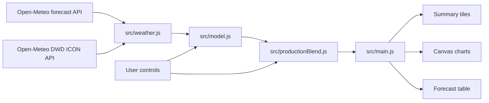
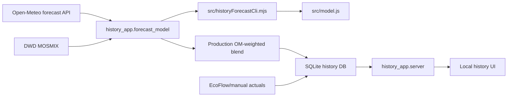

# Solution Architecture

SolarGen has two related but separate applications.

1. The public/static forecast app runs fully in the browser and displays the Open-Meteo-weighted production blend.
2. The local history app runs on this computer, stores SQLite history, captures Open-Meteo and DWD inputs, and exposes the same production-transfer model for forecast-vs-actual tracking.

## Static Browser App



The static app is dependency-free at runtime. It can be served from GitHub Pages and fetches both source forecasts directly in the visitor browser:

- Open-Meteo generic forecast endpoint;
- Open-Meteo DWD ICON endpoint.

### Browser Modules

`src/config.js`

Holds defaults, location, calibration constants, forecast length, and API endpoint.

`src/weather.js`

Builds the Open-Meteo request URL, fetches live forecasts, and creates a deterministic fallback forecast if live fetch fails.

`src/model.js`

Canonical source physical PV model. It groups hourly forecast data, adjusts irradiance for cloud/rain/temperature, applies the site rooftop profile, models battery/load/export flows, and returns daily/hourly totals. It is run once for Open-Meteo and once for DWD ICON in the static browser app.

`src/productionBlend.js`

Browser-side production blend. It applies the DWD stable transfer and combines Open-Meteo current plus DWD stable at equal weights, then recomputes battery/load/export accounting for the blended hourly curve.

`src/main.js`

Browser orchestration: reads controls, fetches forecasts, calls `src/model.js`, and renders DOM state.

`src/chartCore.js`, `src/charts.js`

Canvas rendering primitives and static-app chart renderers.

## Local History And Production App



The local app is intentionally not part of the public static deployment. It runs at `http://127.0.0.1:4183` and stores private operating history in `data/solargen_history.sqlite3`, which is ignored by git.

### History Modules

`history_app.forecast_model`

Fetches Open-Meteo and DWD MOSMIX forecasts, converts each source to the local snapshot format, applies the DWD stable transfer model, and creates the production blend. The browser app uses DWD ICON instead of MOSMIX because the static app needs a direct JSON endpoint; the transfer formula and final blend are the same.

Production model:

```text
production = 0.73 * OM_current_physical
           + 0.27 * DWD_stable
```

with:

```text
DWD_stable = 0.25 * DWD_current_physical
           + 0.75 * DWD_sunshine_rain
           + 4.039
```

`src/historyForecastCli.mjs`

Node bridge used by Python to reuse the Open-Meteo physical model in `src/model.js`.

`history_app.database`

SQLite schema creation, forecast run storage, actual storage, comparison metrics, and detail views.

`history_app.cli`

Command-line capture, actuals entry, and deterministic production-history recomputation.

Important commands:

```sh
python3 -m history_app.cli capture-production
python3 -m history_app.cli recompute-production
python3 -m history_app.cli actual 2026-06-05 --total 30.49
```

`history_app.server`

Local HTTP API and static UI for history comparison.

`history_app/static`

History UI. It shows only the production blend in comparisons. OM and DWD source rows remain in SQLite for audit.

## Data Flow

1. Daily automation or manual capture runs `capture-production`.
2. The capture saves three forecast rows: Open-Meteo input, DWD input, and Production blend.
3. The history UI filters comparison output to `Production blend day-ahead`.
4. Actuals are stored from manual entry or EcoFlow-derived hourly generation.
5. Forecast-vs-actual metrics are computed from SQLite.

## Calibration Summary

Source physical model:

- clear-sky anchor: `2026-05-01`, `50.23 kWh`;
- Open-Meteo calibration note in the app: forecast-vs-actual history through `2026-05-29`.

Production model:

- DWD stable transfer selected from DWD day-ahead history through `2026-05-29`;
- production OM-weighted blend selected from paired OM/DWD day-ahead history through `2026-06-12`;
- stored-history performance on 23 paired actual days: `2.802 kWh` MAE, `3.578 kWh` RMSE, `7.92%` MAPE.

## Deployment Boundary

GitHub Pages serves only the static browser app and documentation. It does not serve the local SQLite database, the history app, or EcoFlow credentials.
