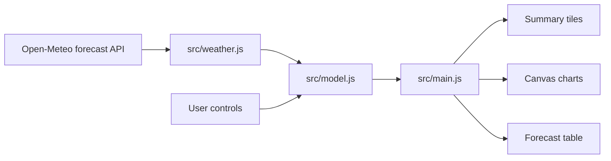

# Solution Architecture

## Overview

The app is a dependency-free static web application. It runs fully in the browser and uses Open-Meteo as the live forecast provider.



## Modules

`src/config.js`

Holds system defaults, location, calibration values, forecast length, and API endpoint.

`src/weather.js`

Builds the Open-Meteo request URL, fetches live forecasts, and creates a deterministic fallback forecast when live data is unavailable.

`src/model.js`

Pure forecasting and accounting logic. This module has no DOM dependency and is covered by tests.

Responsibilities:

- group hourly forecast records by date
- estimate PV output from tilted irradiance and temperature
- calibrate output against the measured full-sun day of 50.23 kWh on May 1, 2026
- model direct self-consumption, battery charge/discharge, grid import, grid export, and curtailment
- compute savings, feed-in earnings, and total value

`src/charts.js`

Canvas rendering for daily and hourly charts. It receives already-computed day models and does not own business logic.

Rendered charts:

- 14 day production/value bars
- selected-day generation and weather curve
- selected-day energy-flow chart for PV, load, and export

`src/main.js`

Browser orchestration: reads controls, fetches forecasts, calls the model, and renders DOM state.

`src/utils.js`

Formatting and small math helpers shared by browser and test code.

## Data Flow

1. The app starts with defaults from `src/config.js`.
2. `src/main.js` calls `fetchOpenMeteoForecast`.
3. `src/weather.js` requests 14 days of hourly forecast data, including `global_tilted_irradiance`, `cloud_cover`, `precipitation`, `temperature_2m`, and weather codes.
4. `src/model.js` simulates energy flow hour by hour.
5. `src/main.js` renders summary values, selected-day detail cards, charts, and the forecast table.

## PV Model

The preferred forecast input is Open-Meteo `global_tilted_irradiance`, requested with:

- `tilt`: user-configured roof tilt
- `azimuth=0`: south-facing in Open-Meteo's convention

Hourly PV output is estimated as:

```text
kWh = irradiance W/m2 / 1000 * capacity kWp * calibrationScale * temperatureFactor
```

The calibration scale is derived from the local clear-sky model so the default 10 kWp system aligns with the measured 50.23 kWh full-sun day.

The model then applies a screenshot-calibrated rooftop profile. This profile reflects the observed behavior from May 1, 2026:

- generation starts around 06:00
- output stays below roughly 1 kW before 10:00
- the main production window opens from 10:00 through late afternoon
- output drops sharply around 17:00

This keeps the forecast tied to the actual installation behavior instead of assuming an unobstructed smooth bell curve.

## Battery and Export Model

For each hour:

1. PV first covers same-hour household load.
2. Battery discharges to cover remaining load.
3. Remaining PV charges the battery at 94% charge efficiency.
4. Rooftop PV is clipped at the feed-in cap for the grid-facing delivered curve.
5. Any rooftop PV above the cap is counted as curtailed.
6. Delivered PV then covers home load, charges the battery, and exports remaining surplus to the grid.

The model stores both `pv` and `deliveredPv`:

- `theoreticalPv`: weather-adjusted irradiance potential before the site profile.
- `pv`: screenshot-calibrated rooftop generation before cap-related curtailment.
- `deliveredPv`: grid-facing generation after the 6 kW cap, equal to `pv - curtailed`.

The model is intentionally simple and transparent. It does not yet model inverter efficiency curves, asymmetric battery charge/discharge limits, dynamic tariffs, or measured household load imports.

## Household Load Model

The default load profile is calibrated to roughly `10 kWh/day`:

```text
24h * base load
+ 10h * daytime extra
+ 2h * 45% morning daytime ramp
+ 5h * evening extra
```

With defaults, this is:

```text
24 * 0.20 + 10 * 0.20 + 2 * 0.45 * 0.20 + 5 * 0.60 = 9.98 kWh/day
```

## Revenue Model

Savings:

```text
selfConsumed kWh * avoided import price
```

Feed-in earnings:

```text
exported kWh * feed-in tariff
```

Total value:

```text
savings + feed-in earnings
```

## External Dependencies

Runtime dependency:

- Open-Meteo forecast API

Development dependency:

- Node.js for tests and syntax checks

There are no npm package dependencies.
