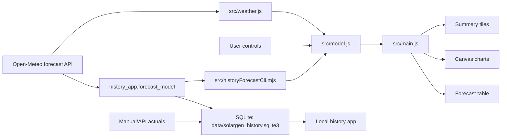

# Solution Architecture

## Overview

The app is a dependency-free static web application. It runs fully in the browser and uses Open-Meteo as the live forecast provider.



## Modules

`src/config.js`

Holds system defaults, location, calibration values, forecast length, and API endpoint.

`src/weather.js`

Builds the Open-Meteo request URL, fetches live forecasts, and creates a deterministic fallback forecast when live data is unavailable.

`src/model.js`

Pure forecasting and accounting logic. This module has no DOM dependency and is covered by tests.

Responsibilities:

- group hourly forecast records by date
- estimate PV output from tilted irradiance and temperature
- anchor clear-sky output against the measured full-sun day of 50.23 kWh on May 1, 2026
- recalibrate weather response against measured forecast history from May 4-12, 2026
- model direct self-consumption, battery charge/discharge, grid import, grid export, and curtailment
- compute savings, feed-in earnings, and total value

This is the canonical PV model for both the browser forecast and local history capture.

`src/historyForecastCli.mjs`

Command-line bridge used by the Python history app. It converts day-ahead Open-Meteo payloads into the same forecast snapshot shape the SQLite database stores, while reusing `src/model.js`.

`src/chartCore.js`

Shared canvas primitives for the forecast app and the local history app: high-DPI canvas setup, grid/axis drawing, legends, line/bar drawing, hit testing, and tooltips. This module has no SolarGen business rules and is unit-tested directly.

`src/charts.js`

Forecast-specific canvas rendering for daily and hourly charts. It receives already-computed day models, delegates generic drawing to `src/chartCore.js`, and does not own business logic.

Rendered charts:

- 14 day production/value bars
- selected-day generation and weather curve
- selected-day energy-flow chart for PV, load, and export
- selected-day battery charge curve

`src/main.js`

Browser orchestration: reads controls, fetches forecasts, calls the model, and renders DOM state.

`src/utils.js`

Formatting and small math helpers shared by browser and test code.

## Data Flow

1. The app starts with defaults from `src/config.js`.
2. `src/main.js` calls `fetchOpenMeteoForecast`.
3. `src/weather.js` requests 14 days of hourly forecast data, including `global_tilted_irradiance`, `cloud_cover`, `precipitation`, `temperature_2m`, and weather codes.
4. `src/model.js` simulates energy flow hour by hour.
5. `src/main.js` renders summary values, selected-day detail cards, charts, and the forecast table.

## PV Model

The preferred forecast input is Open-Meteo `global_tilted_irradiance`, requested with:

- `tilt`: user-configured roof tilt
- `azimuth=0`: south-facing in Open-Meteo's convention

Hourly PV output is estimated as:

```text
kWh = cloudAdjustedIrradiance W/m2 / 1000 * capacity kWp * calibrationScale * temperatureFactor
```

The calibration scale is derived from the local clear-sky model so the default 10 kWp system aligns with the measured 50.23 kWh full-sun day on May 1, 2026. The weather response is separately recalibrated against measured forecast history from May 4-12, 2026.

The model includes an empirical weather response fitted from the stored actual-vs-forecast comparisons. It uses hourly tilted irradiance, cloud cover, precipitation, and temperature plus daily rain, mean cloud cover, and sunshine duration. Low-irradiance overcast hours can be lifted, while bright high-cloud hours are damped on wet, low-sun, high-cloud days where raw tilted irradiance has historically over-forecast.

The model then applies a screenshot-calibrated rooftop profile. On clear hours this profile reflects the observed behavior from May 1, 2026:

- generation starts around 06:00
- output remains limited before late morning
- the main production window opens from late morning through late afternoon
- output drops through the late afternoon and evening

For cloudy hours, the model blends toward a smoother diffuse-light profile. This uses cloud cover as the blend weight and daily weather damping to avoid the latest observed failure mode: bright hourly irradiance on a wet, low-sun overcast day.

This keeps the forecast tied to the actual installation behavior instead of assuming one unobstructed smooth bell curve or one fixed step profile for every weather condition.

## Battery and Export Model

For each hour:

1. PV first covers same-hour household load.
2. Battery discharges to cover remaining load.
3. Remaining PV charges the battery at 94% charge efficiency.
4. Rooftop PV is clipped at the feed-in cap for the grid-facing delivered curve.
5. Any rooftop PV above the cap is counted as curtailed.
6. Delivered PV then covers home load, charges the battery, and exports remaining surplus to the grid.

The model stores both `pv` and `deliveredPv`:

- `theoreticalPv`: weather-adjusted irradiance potential before the site profile.
- `pv`: screenshot-calibrated rooftop generation before cap-related curtailment.
- `deliveredPv`: grid-facing generation after the 6 kW cap, equal to `pv - curtailed`.

The model is intentionally simple and transparent. It does not yet model inverter efficiency curves, asymmetric battery charge/discharge limits, dynamic tariffs, or measured household load imports.

## Household Load Model

The default load profile is calibrated to roughly `10 kWh/day`:

```text
24h * base load
+ 10h * daytime extra
+ 2h * 45% morning daytime ramp
+ 5h * evening extra
```

With defaults, this is:

```text
24 * 0.20 + 10 * 0.20 + 2 * 0.45 * 0.20 + 5 * 0.60 = 9.98 kWh/day
```

## Revenue Model

Savings:

```text
selfConsumed kWh * avoided import price
```

Feed-in earnings:

```text
exported kWh * feed-in tariff
```

Total value:

```text
savings + feed-in earnings
```

## External Dependencies

Runtime dependency:

- Open-Meteo forecast API

Development dependency:

- Node.js for tests and syntax checks

There are no npm package dependencies.


## Local History Architecture

The local history app is intentionally separate from the published static forecast page. It runs only on this computer and stores data in SQLite at `data/solargen_history.sqlite3`.

Modules:

- `history_app.forecast_model`: fetches Open-Meteo day-ahead data and applies the same PV conversion assumptions used by the browser app.
- `history_app.database`: owns schema creation, forecast snapshot storage, actual generation storage, and comparison metrics.
- `history_app.cli`: command-line capture and actuals entry.
- `history_app.server`: local-only HTTP app at `127.0.0.1:4183`.
- `history_app/static`: browser UI for capture, manual actual entry, comparison table, and hourly profile chart.

The split keeps private operating history off the public GitHub Pages deployment while preserving a clear future path for API actual ingestion. An API importer should write to `actual_days` and `actual_hours`; comparison code then works without changes.
